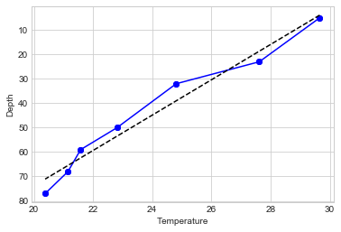

# TMIFVP
***
## TMI for Fun Vertical Profiles

### or

## Template Matching to Identify Features in Vertical Profiles
***

#### Collaborators
Paige Lavin: University of Washington

Regina Lionheart: University of Washington

Karina Ramos Musalem: University of British Columbia

Kathy Gunn: University of Miami

Daniel Wang: Virginia Institute of Marine Science, William & Mary

Anna-Lena Deppenmeier: NCAR

***

### The Problem

Tired of cruddy depth profiles? Want to know just how bad your instruments effed up their data collection? Then TMIVP, built upon the ideas of the visionary non-conformist Procrustes, is for you. 

Between instrumentation, environmental factors, and poor data acquisition methods, understanding and troubleshooting low-quality CTD profiles (along with other types of profile graphs) are a persistant issue in environmental science. TMIVP aims to quantify the difference between a template CTD profile and user-submitted data, clearly highlighting features for consistent classification of problematic or interesting attributes. More broadly, this pipeline could be used to analyze and compare many types of line graphs, including but not limited to:

+ Michaelis-Menten population curves to characterize population growth
+ Metabolomic and proteomic spectrographic peaks to understand analytical drift, matrix effects and other obscuring variations
+ Environmental time series data to identify outliers

Below, our gruesome, cut-to-fit-the-bed cutting pipeline.

### The Solution

*This needs to be expanded upon once we have more specifics*
Our group used **SPECIFICS GO HERE** to compare **OUR REAL DATA IN THIS REAL LOCATION** to a template profile created using **WHY DID WE PICK THIS KIND OF TEMPLATE? WHAT'S THE JUSTIFICATION?**. 

***

### Steps to achieve Profile Nirvana
1. User provides two 1-dimensional arrays to the interface, one temperature and one depth to visualize their profile. **ARE THESE FROM THE UPLOADED (net)CDF FILES?** These are combined to create a uniform table of depth and temperature.

*Example Arrays: Uploaded from University of Haifa's THEMO Buoy located off the coast of Israel.*
```
temp = np.asarray(df.temperature)
array([29.66, 27.62, 24.81, 22.81, 21.58, 21.15, 20.38])

depth = np.asarry(df.depth)
array([5, 23, 32, 50, 59, 68, 77])

```

*Example Table*

Temp = x | Depth = y
--- | --- 
29.66 | 5
27.62 | 23
24.81 | 32   
22.81 | 50   
21.58 | 59 
21.15, | 68 
20.38 | 77 


2. TMIFVP provides a "template" shape that has typical numbers and dimensions **HOW DID WE DECIDE WHAT A CORRECT TEMPLATE IS?** Pick which one works best for your data according to location and season. **WILL WE HAVE THESE FILTERING PARAMETERS?**


2. TMIFVP code matches the two by **TAKING AREAS UNDER THE CURVE, CONVOLVING IT AMONG THE USER PROFILE? ARE WE STILL DOING THE VERTICAL SEGMENTATION?**

3. The code returns a correlation across the convolved profile.




3. "Match" the two. 
..* Vertically segment by user-defined parameters. 


***
Extra Notes

Possibly add lon and latitude for global placement
Add in photo.

You have some template and profile and convolve it along the user profile
Code will return correlation across convolved profile
track cross-correlations between template and profile
Will have a number for every profile. Cluster those numbers. Provides a dynamically adjustable threshold. 
What kind of vertical resolution for your profile do you  need? Do a cross correlation at increasing frequency. 

Procrustes takes care of the scaling for you. 


***


